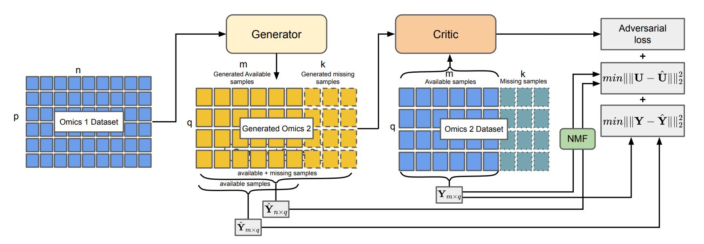

# OmicsNMF
OmicsNMF is a generative adversarial network based framework that can impute a target omics from the source omics designed with a novel objective function the utilizes non negative matrix factorization.


## **Overall Framework**


## Run Locally
Clone the reporsitory and open it.

```
git clone https://github.com/compbiolabucf/OmicsNMF.git
cd OmicsNMF
```

Create an anaconda environment with required libraries

```
conda env create -f environment.yml
```
Run the code using train.py and provide data path to source and target omics csv files where target csv will have a few missing samples to be imputed. After running the code imputed data will be saved inside **saved_models** directory with the name provided in **key** parameter as a csv file. 

```
python train.py -source data/mRNA.csv -target data/miRNA.csv
```

By default the best model will be found based on the MSE of the imputed data. However if you have phenotype information or label provide that in the training command so that the best model will be found based on prediction AUC. 

```
python train.py -source data/mRNA.csv -target data/miRNA.csv -label data/label.csv
```

There are other basic hyper-parameters that can be changed in the script. 

To change the model architecture edit the **model.py** inside **codes** directory. 

If you want to use a different classifier, define it inside the **get_classifier** method in **codes/utils.py** script. 


